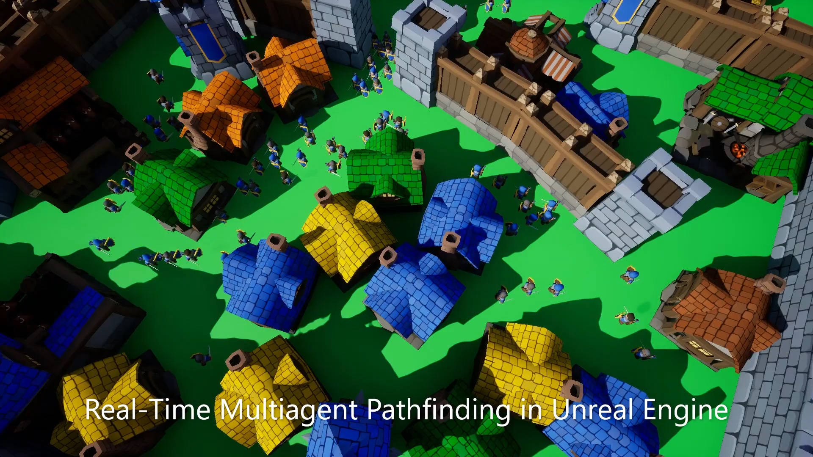
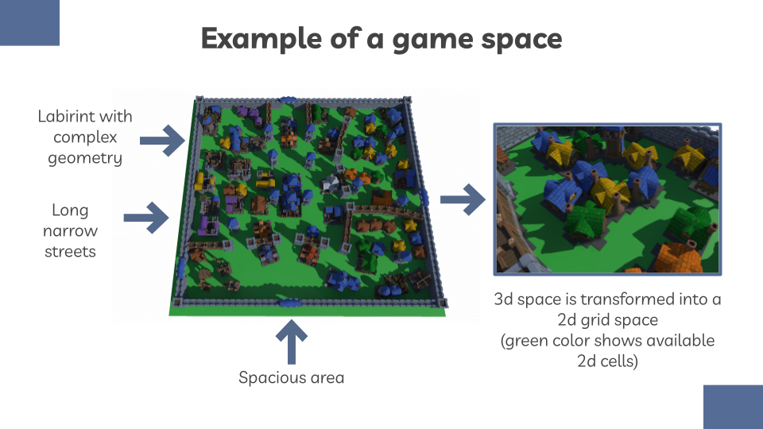
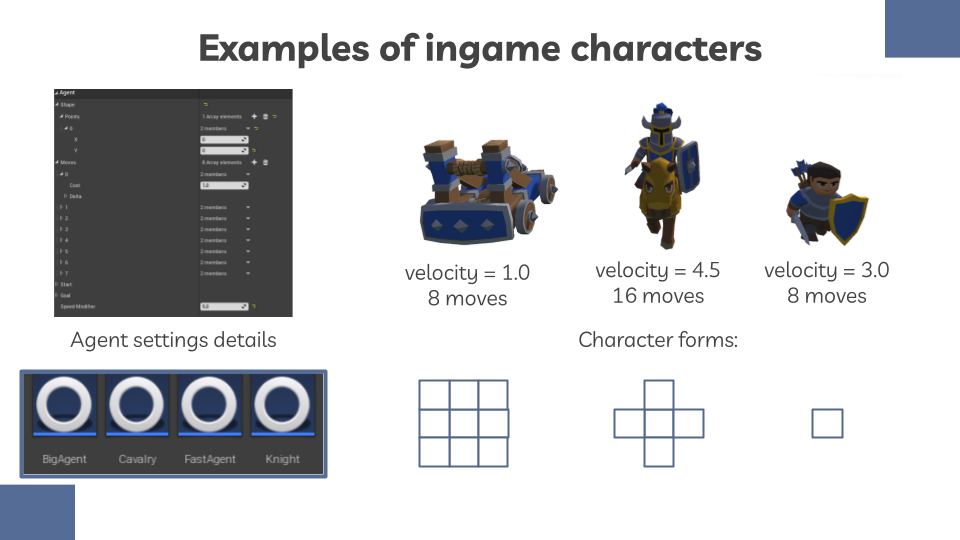
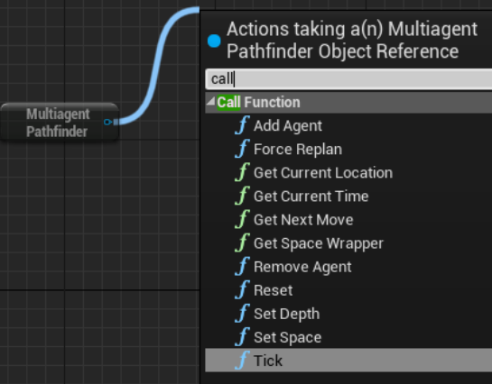
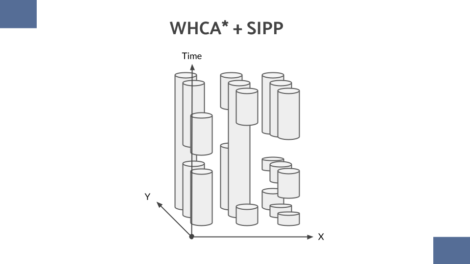
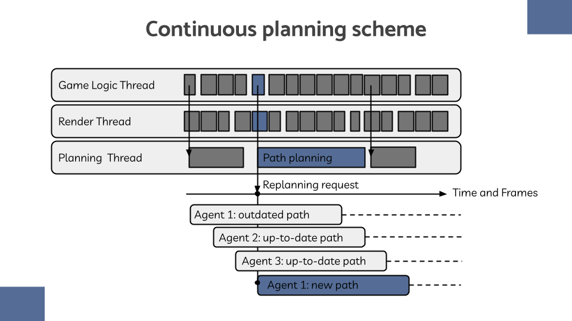

# Real-Time Multiagent Pathfinding

This repository contains an Unreal Engine 4 plugin for multiagent pathfinding in real time. 
That means that if you apply this plugin to your project, you will be able to have AI agents with different shapes and speed values planning paths together and replanning when new agents arrive or old ones disappear.

**Check out this awesome video demonstration:** https://youtu.be/ZANt1uHhGTY?si=QWy76DyG5KaDWIJD.

### Usage Example

Let's examine a tech demo that uses this plugin. The level geometry consists of different types of areas, including long narrow streets, crowded areas with chaotically put small buildings, labyrinths, spacious areas without any buildings. In order to build a path planning grid, plugin presents a tool that is similar in usage to a navigation mesh. This grid uses collision forms of objects to build a 2d grid space.

The assignment for the AI in this demo is to have AI agents with different configurations moving toward their goals. Plugin allows to create multiple types of agents. Below you can find a slide that displays 3 types of agents (a knight, a catapult, a horse rider) that were set up using classes provided by the plugin.

After level 2d grid and all character types are set up, and placed on the level, user can give Multiagent Pathfinder subsystem commands to add/remove agents, get agent location and so on. In the tech demo these simple functions are used to navigate actors on the level. This simple interface allows to add and remove agents in runtime (subsytem will change plans of existing agents to make them avoid new agents or to make more efficient paths if there is more space). Agent objects support changing of goals, which allows to create complex gameplay scenarios.

### Implementation details

This plugin is based on WHCA* and SIPP algorithms. Basic principles of WHCA* planning are borrowed from my earlier project about [mutliagent pathfinding](https://github.com/MShepelin/RealTimeMAPF), so you can check out readme in this repository for more details. What is different in the plugin presented in this repository, is that it uses safe interval pathfinding which allows to navigate continuous time space instead of discrete time space in the shared paths table. This approach allows agents to have different velocities defined by continuous values.

 

This system is very flexible, as you can see. It allows to add not only new agents and add new plans but also to add moving obstacles, which will just create "holes" in space intervals, limiting possible navigation for agents.

In this implementation planning is dynamic, it happens all the time, while system is running. Agents paths are replanned regularly, and the planning window is fixed. Plans can be updated in case planning goals change, every agent maintains a current path plan, so if plan should be changed, the old one is used to "refill" planning table, and allow a new plan to be generated.

